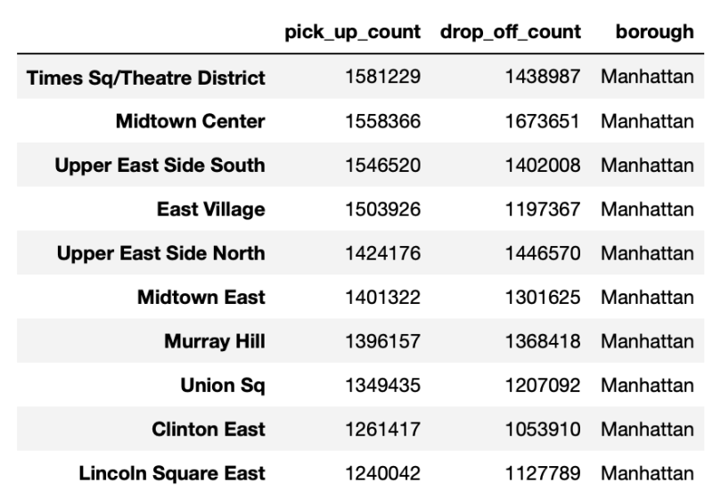

# Big Data HW1

3095555024 郭家宏

## Description

- Tools:
    - python for implementation.
    - pandas, datatable for loading tabular data.
        - datatable is more efficiency than pandas when load data and statistic.
        - pandas is more convenience for visualize.
    - geopandas and shapely for mapping longitude and latitude to zone.
    - datetime for convert datetime to hours.
    - multiprocessing for speed up mapping.
- Dataset: NYC Taxi Data
    - Number of identity: 41859909
    - Number of features: 18
    - Delete 'store_and_forward', 'Rate_Code', 'mta_tax' column because of None value.
    - Add '(pick_up/drop_off) (zone/borough)' columns for statistic.
- I used [Taxi Zone Shapefile](https://s3.amazonaws.com/nyc-tlc/misc/taxi_zones.zip) to help for visualization.
- To statistic the regions of pickups and drop off, I have to map the longitude and latitude to New York Taxi zone and borough. Here is my self-define function for mapping.

```python=
from pyproj import CRS
crs = CRS('epsg:4326')
def cor2loc(df, lon_var, lat_var, name_var):
    local_df = df.copy()
    shape_df = geopandas.read_file('taxi_zones/taxi_zones.shp')
    shape_df.drop(['OBJECTID', 'Shape_Area', 'Shape_Leng'], 
                  axis=1, inplace=True)
    shape_df = shape_df.to_crs(crs)
    
    try:
        local_gdf = geopandas.GeoDataFrame(local_df, crs=crs,
                    geometry=[Point(xy) for xy in zip(local_df[lon_var], 
                                                      local_df[lat_var])])
        local_gdf = geopandas.sjoin(local_gdf, shape_df, 
                                    how='left', op='within')
        local_gdf = local_gdf.drop('geometry', axis=1)
        local_gdf = local_gdf.drop('index_right', axis=1)
        local_gdf.rename(columns={'zone':f'{name_var}_Zone', 
                                  'LocationID':f'{name_var}_ID', 
                                  'borough':f'{name_var}_borough'},
                         inplace=True)
        return local_gdf
    except ValueError as ve:
        series = df[lon_var]
        return series
```

## Question

### Q1: What regions have the most pickups? What are the top-5 regions with the most pickups and drop-offs (pickups and drop-offs should be counted separately)?

- Most pickups: Times Sq/Theatre District (1,581,229)
- Most drop-offs: Midtown Center (1,673,651) 

| Rank |                Pickups                |               Drop-offs               |
|:----:|:-------------------------------------:|:-------------------------------------:|
|  1   | Times Sq/Theatre District (1,581,229) |      Midtown Center (1,673,651)       |
|  2   |      Midtown Center (1,558,366)       |   Upper East Side North (1,446,570)   |
|  3   |   Upper East Side South (1,546,520)   | Times Sq/Theatre District (1,438,987) |
|  4   |       East Village (1,503,926)        |   Upper East Side South (1,402,008)   |
|  5   |   Upper East Side North (1,424,176)   |        Murray Hill (1,368,418)        |

- I count pickups and drop-offs separately.

#### Top 10 of pickups

[![Alt text]](./figure/1.png)

#### Hypsometric maps (zone) of pickups


#### Top 10 of drop-offs


#### Hypsometric maps (zone) of drop-offs


#### Pickups and drop-offs (Borough)

- And I also count the pickups and drop-offs for every borough.
- The most pickups and drop-offs borough are Manhattan.
- There are many pikups and drop-offs regions not in New York (None value).
- From the pie figure, we can easly recognize most of pickups and drop-offs are in Manhattan.


### Q2: When are the peak hours and off-peak hours for taking a taxi?


- I convert datetime to 24 hours.
    - 0 means 12 a.m. to 1 a.m.
    - 1 means 1 a.m. to 2 a.m.
    - ....
- Count the number for each range.
- As figure show, the peak hour is 7 p.m. to 8 p.m.
- The off-peak hour is 5 a.m. to 6 a.m.

### Q3: What are the differences between big and small total amounts when taking a taxi?


#### Amount table

|        |  Fare  | Surcharge |  Tip   | Tolls  |  Total  |
|:------:|:------:|:---------:|:------:|:------:|:-------:|
|  Min   |  2.5   |    0.0    |  0.0   |  0.0   |   2.5   |
|  Max   | 200.0  |    5.0    | 100.0  |  20.0  |  235.2  |
| Median |  7.7   |    0.0    |  0.0   |  0.0   |   8.1   |
|  Mean  | 9.6808 |  0.1826   | 0.4990 | 0.1257 | 10.4911 |
|  Std   | 7.3570 |  0.3212   | 1.3405 | 0.7609 | 8.3936  |

- Accroding to the table, total amounts are dominate by fare amounts. So we can only analysis total amount.

#### Total amount inter quartile range

| Quartile | Total Amount |
|:--------:|:------------:|
|    1     |     5.9      |
|    2     |     8.1      |
|    3     |     11.7     |


- Accroding to the inter quartile range, I define the total amount less than 5.9 are 'small' and greater than 11.7 are 'big'.

#### Relation between total amount and Time


- I find out that small total amounts are high ratio in 5 a.m. to 4 p.m. and big total amounts vice versa.

#### Relation between total amount and Borough


- Accroding to the histogram, we can find that small amount is high ratio in Manhattan but other borough vice versa.

## Problem encounter

- The biggest problem that I encounter is the amount of data. When I mapping the longitude and latitude to zone, it is very time consuming.
- So I use multiprocessing to speed up the process. Here are my multiprocessing code

```python=
from multiprocessing import Pool
from itertools import repeat
def multiple_mapping(num_of_pool, list_df,lon_var, lat_var, name_var):
    with Pool(num_of_pool) as pool:
        second_arg = lon_var
        third_arg = lat_var
        forth_arg = name_var
        new_list = pool.starmap(cor2loc, 
                                zip(list_df, repeat(second_arg), 
                                repeat(third_arg), repeat(forth_arg)))
    return new_list
```
